# Documentação de Arquitetura (DAM Assistant)

## Stack Tecnológica

### Backend 1: Motor de IA & Mensageria
- **Linguagem/Framework:** Python 3.x com FastAPI.
- **Responsabilidade:** Processamento de mensagens via Webhooks, comunicação com APIs de LLMs (Gemini/OpenAI) e orquestração de **Function Calling** para execução das ferramentas (Tools).
- **Hospedagem:** Google Cloud Run (Containerizado via Docker).
- **Integração WhatsApp:** Evolution Go (Golang) gerindo a sessão WA e batendo via webhook no FastAPI.

### Backend 2: Core API (Dashboard)
- **Linguagem/Framework:** Java 17+ com Spring Boot 3.
- **Responsabilidade:** API Restful robusta para agregação de dados e fornecimento de endpoints seguros para a aplicação Front-end. Comunica-se com o banco de dados.
- **Hospedagem:** Google Cloud Run.

### Frontend: Dashboard Web
- **Linguagem/Framework:** TypeScript, Angular (Standalone Components), HTML5, SCSS.
- **Responsabilidade:** Consumir a Core API para apresentar métricas, gráficos financeiros e de saúde.
- **Hospedagem:** Firebase Hosting.

### Banco de Dados e Armazenamento
- **Banco de Dados Principal:** Firebase Firestore (NoSQL - Spark Plan gratuito).
- **Responsabilidade:** Armazenar *health_metrics*, *finances*, *notes_reminders*, *gift_ideas*, *special_dates*, *item_locations*, *vault_credentials*, *trip_groups*, *trip_expenses*, logs de conversas, e estado das integrações.
- **SDKs:** Acesso feito pelas duas APIs via *Firebase Admin SDK*.

## Integrações Externas (Pilares)
1. **Health Auto Export (iOS):** Envio de JSON via POST (Webhooks no FastAPI).
2. **Uconnect (Stellantis):** Comunicação via cliente não-oficial em Python (`ha-stellantis`).
3. **HLTV (Esports):** Web Scraping/API não-oficial em Python (BeautifulSoup / HLTV-API).
4. **Google Calendar:** Autenticação via Service Account (GCP) com Google Calendar API v3 (agendamento, eventos, descrição e localização).
5. **GCP Billing:** Alertas recebidos do Pub/Sub -> Push Subscription para endpoint webhook FastAPI.
6. **Alexa Smart Home:** Acionamento via requisições HTTP (VoiceMonkey ou SinricPro).
7. **Google Maps Platform (Directions API):** Consulta de rotas, tempo de viagem, condições de trânsito em tempo real e cálculo de deslocamento.
8. **Segundo Cérebro & Memória Pessoal:** Anotações, Lembretes com agendamento e Curadoria proativa de ideias de presentes com alerta prévio.
9. **Visão Computacional & Rateio de Despesas:** OCR de notas fiscais de restaurantes via Gemini Vision, interpretação de consumo e divisão com 10% do garçom e Pix.
10. **Memória Espacial ("Onde Guardei Isso?"):** Registro de localização de objetos cotidianos e busca semântica em linguagem natural.
11. **Cofre Seguro de Senhas (Zero-Knowledge):** Armazenamento de credenciais e senhas com criptografia AES-256-GCM, proteção de chave mestra e sanitização total de logs.
12. **Guia de Streaming e Entretenimento:** Consulta de disponibilidade de filmes e séries em plataformas no Brasil via TMDB API / JustWatch.
13. **Planejador de Eventos & Churrasco:** Cálculo volumétrico per capita de carnes, carvão, bebidas, gelo e acompanhamentos.
14. **Tradutor Gastronômico de Cardápios (Vision):** OCR multilíngue de cardápios internacionais com explicação cultural de ingredientes e preparo.
15. **Conversor Universal Instantâneo:** Motor matemático determinístico para conversão de distâncias (mi/km, ft/cm), temperatura (°F/°C), massa (lb/kg) e volumes.
16. **"Splitwise" de Bolso e Liquidação de Viagens:** Ledger de despesas compartilhadas em grupo com algoritmo de liquidação de saldos mínimos via Pix.

## Padrões de Projeto (Design Patterns)
- **Python (FastAPI):**
  - **Modular Monolith/Microservice:** Organização em rotas separadas por "Pilar" (ex: `routers/health.py`, `routers/vehicle.py`).
  - **Strategy Pattern / Factory:** Para gerenciar e registrar dinamicamente os *Tools* do LLM.
  - **Processamento Multimodal:** Suporte à recepção de áudio e imagem via Evolution API com inferência multimodal no Gemini (visão computacional para notas/comprovantes/cardápios e transcrição de áudio).
  - **Criptografia e SecOps:** Criptografia simétrica autenticada (AES-GCM) para dados sensíveis em repouso e sanitização estrita no ChatRepository.
  - **Funções Determinísticas:** Motores de conversão e cálculo matemático isolados de alucinação de LLM.
- **Java (Spring Boot):**
  - **Controller -> Service -> Repository Pattern:** Uso obrigatório de injeção de dependência.
  - **DTOs:** Isolar as entidades de banco (Documentos Firestore) das representações expostas na web.
- **Segurança (Ambos):** Uso de *Bearer Tokens / API Keys* para endpoints de Webhook.

## Escalabilidade e Concorrência
- **Cloud Run:** Escala automática (Scale-to-zero) otimizando custos e atendendo picos de mensagens.
- **Firestore:** Coleções isoladas sem gargalos de locks relacionais.

## Diagrama Inicial (Conceitual)

```mermaid
graph TD;
    User[Usuário WhatsApp] <--> |Evolution API| Mensageria[FastAPI Motor LLM]
    Mensageria <--> |Function Calling| Tools[Módulos de Integração]
    Mensageria <--> Firestore[(Firebase Firestore)]
    
    Tools -.-> Health[Health Auto Export Webhook]
    Tools -.-> Veiculo[Uconnect API]
    Tools -.-> Esports[HLTV API]
    Tools -.-> Calendar[Google Calendar]
    Tools -.-> Alexa[Alexa Webhooks]
    Tools -.-> Maps[Google Maps Directions API]
    Tools -.-> Notes[Anotações & Lembretes]
    Tools -.-> Gifts[Curador de Presentes]
    Tools -.-> Split[Divisor de Contas OCR]
    Tools -.-> Items[Memória de Objetos]
    Tools -.-> Vault[Cofre de Senhas AES-256]
    Tools -.-> Stream[Guia de Streaming TMDB]
    Tools -.-> BBQ[Calculadora de Churrasco]
    Tools -.-> MenuTrans[Tradutor de Cardápios Vision]
    Tools -.-> Converter[Conversor Universal]
    Tools -.-> TripSplit[Splitwise de Bolso]
    Tools -.-> WorkHours[Calculadora de Banco de Horas]
    
    GCPBilling[GCP Pub/Sub] --> Mensageria
    
    Front[Dashboard Angular] <--> |REST API| CoreAPI[Spring Boot Core]
    CoreAPI <--> Firestore
```

## Topologia de Deploy e Infraestrutura GCP

### 1. GCP Compute Engine (`dam-server`)
* **Especificação:** VM `e2-micro` (1 vCPU, 1 GB RAM, Linux Debian 12, Disco de 10GB Standard).
* **Zona:** `us-central1-a` | **Projeto:** `bot-dam`.
* **Firewall Rules:** `allow-dam-ports` (Ingress permitido para portas `8000` e `8080`).
* **Containers Gerenciados (Docker Compose):**
  * `dam_backend_ia` (Porta 8000): FastAPI, Uvicorn, SDK Gemini, Registry de Tools.
  * `evolution_api` (Porta 8080): Baileys Go v2, gateway de WhatsApp com QR Code.
  * `postgres_db` (Porta 5432 interna): Banco de dados de estado de conexão da Evolution API.

### 2. Google Cloud Run & Serverless
* **Core API (Spring Boot 3):** Hospedada no Cloud Run com auto-scaling 0 a 1, fornecendo endpoints consolidados para o Dashboard.
* **Tarefas Proativas (Fases 9 e 10):** Orquestradas via Cloud Tasks e Cloud Scheduler chamando o webhook do backend.

### 3. Armazenamento & Persistência (Firebase Firestore)
* **Modo:** Cloud Firestore Nativo (NoSQL).
* **Coleções:**
  * `chat_logs`: Histórico de mensagens recebidas e respostas do bot.
  * `health_metrics`: Séries temporais de saúde (Health Auto Export).
  * `finances`: Lançamentos de receitas e despesas.
  * `item_locations`: Memória espacial de objetos.
  * `vault_credentials`: Senhas criptografadas com AES-256-GCM.
  * `trip_groups` & `trip_expenses`: Grupos e despesas de rateio estilo Splitwise.

### 4. Frontend & CDN (Firebase Hosting)
* **Dashboard Angular 17:** Compilado como SPA estática, servido via CDN global do Google com SSL gerenciado automaticamente.

### 5. Esteira de CI/CD (GitHub Actions)
* Definida em `.github/workflows/ci-cd.yml` com jobs paralelos de CI (Python Pytest/SecOps e Angular Build) e CD automático para a VM do GCP em merges na branch `main`.
