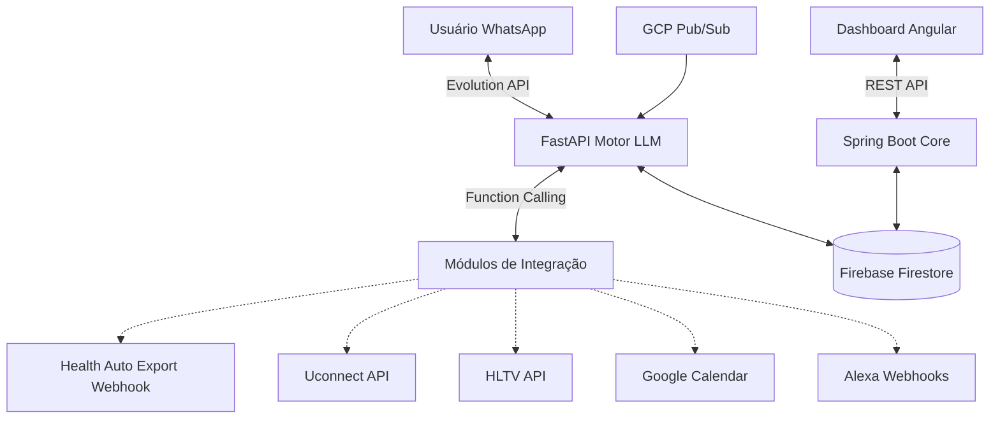

# Documentação de Arquitetura (DAM Assistant)

## Stack Tecnológica

### Backend 1: Motor de IA & Mensageria
- **Linguagem/Framework:** Python 3.x com FastAPI.
- **Responsabilidade:** Processamento de mensagens via Webhooks, comunicação com APIs de LLMs (Gemini/OpenAI) e orquestração de **Function Calling** para execução das ferramentas (Tools).
- **Hospedagem:** Google Cloud Run (Containerizado via Docker).
- **Integração WhatsApp:** Evolution Go (Golang) gerindo a sessão WA e batendo via webhook no FastAPI.

### Backend 2: Core API (Dashboard)
- **Linguagem/Framework:** Java 17+ com Spring Boot 3.
- **Responsabilidade:** API Restful robusta para agregação de dados e fornecimento de endpoints seguros para a aplicação Front-end. Comunica-se com o banco de dados.
- **Hospedagem:** Google Cloud Run.

### Frontend: Dashboard Web
- **Linguagem/Framework:** TypeScript, Angular (Standalone Components), HTML5, SCSS.
- **Responsabilidade:** Consumir a Core API para apresentar métricas, gráficos financeiros e de saúde.
- **Hospedagem:** Firebase Hosting.

### Banco de Dados e Armazenamento
- **Banco de Dados Principal:** Firebase Firestore (NoSQL - Spark Plan gratuito).
- **Responsabilidade:** Armazenar *health_metrics*, *finances*, logs de conversas, e estado das integrações.
- **SDKs:** Acesso feito pelas duas APIs via *Firebase Admin SDK*.

## Integrações Externas (Pilares)
1. **Health Auto Export (iOS):** Envio de JSON via POST (Webhooks no FastAPI).
2. **Uconnect (Stellantis):** Comunicação via cliente não-oficial em Python (`ha-stellantis`).
3. **HLTV (Esports):** Web Scraping/API não-oficial em Python (BeautifulSoup / HLTV-API).
4. **Google Calendar:** Autenticação via Service Account (GCP) com Google Calendar API v3.
5. **GCP Billing:** Alertas recebidos do Pub/Sub -> Push Subscription para endpoint webhook FastAPI.
6. **Alexa Smart Home:** Acionamento via requisições HTTP (VoiceMonkey ou SinricPro).

## Padrões de Projeto (Design Patterns)
- **Python (FastAPI):**
  - **Modular Monolith/Microservice:** Organização em rotas separadas por "Pilar" (ex: `routers/health.py`, `routers/vehicle.py`).
  - **Strategy Pattern / Factory:** Para gerenciar e registrar dinamicamente os *Tools* do LLM.
- **Java (Spring Boot):**
  - **Controller -> Service -> Repository Pattern:** Uso obrigatório de injeção de dependência.
  - **DTOs:** Isolar as entidades de banco (Documentos Firestore) das representações expostas na web.
- **Segurança (Ambos):** Uso de *Bearer Tokens / API Keys* para endpoints de Webhook.

## Escalabilidade e Concorrência
- **Cloud Run:** Escala automática (Scale-to-zero) otimizando custos e atendendo picos de mensagens.
- **Firestore:** Coleções isoladas sem gargalos de locks relacionais.

## Diagrama Inicial (Conceitual)

