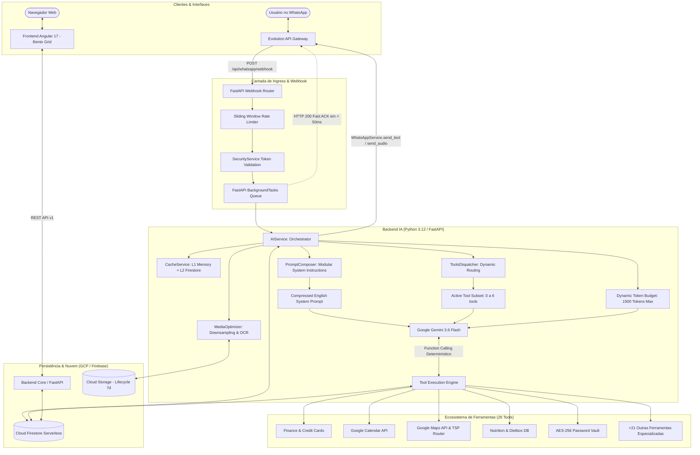

# Arquitetura Técnica Global e Guia de Engenharia — DAM Assistant

Bem-vindo à documentação técnica oficial do **DAM (Digital Autonomous Manager)**. Este documento foi concebido para que qualquer engenheiro de software que nunca tenha tido contato prévio com a base de código consiga compreender integralmente a topologia da aplicação, seus padrões de projeto, os fluxos de dados, os mecanismos de defesa e isolamento, e as práticas avançadas de **Tokenomics** e **FinOps** em produção.

---

## 1. Visão Geral do Sistema e Topologia

O DAM é um ecossistema de assistência pessoal inteligente multimodal projetado para operar com **zero-downtime**, **alta reatividade** (< 2s no webhook), **isolamento multi-tenant rigoroso** e **custo mínimo** em infraestrutura Serverless (Google Cloud Platform).

### 1.1 Diagrama de Arquitetura de Alto Nível



---

## 2. Arquitetura do Frontend (`frontend_dashboard`)

O frontend é uma SPA (Single Page Application) moderna construída em **Angular 17**, focada em visualização de dados em tempo real, alta densidade informacional e experiência premium.

### 2.1 Principais Decisões Arquiteturais do Front
1. **Standalone Components:** Todos os componentes utilizam a arquitetura moderna do Angular sem `NgModule`, garantindo tree-shaking otimizado e tempos de carregamento mínimos.
2. **Angular Signals:** Reatividade baseada em `signal()`, `computed()` e `effect()`, eliminando o overhead tradicional do Zone.js e simplificando o fluxo unidirecional de dados.
3. **Design System "Dark Cyber":**
   - Paleta de cores escura com acentos em neon (Ciano `#00f5d4`, Roxo `#7209b7`, Magenta `#f72585`, Âmbar `#ffb703`).
   - Tokens SCSS centralizados para espaçamento, tipografia, elevação e transições.
   - Layout baseado em **Bento Grid** responsivo que se adapta perfeitamente de telas mobile a ultrawide.
   - Glassmorphism com `backdrop-filter: blur(12px)` e bordas sutis com gradiente.
4. **Camada de Serviços (Services):**
   - Serviços dedicados para consumo da API REST (`FinanceService`, `HealthService`, `MetricsService`).
   - Interceptors HTTP para injeção de tokens de autenticação Firebase Auth e tratamento global de erros.

---

## 3. Arquitetura do Backend Core (`backend_core`)

O Backend Core é responsável pela API REST estruturada que alimenta o Dashboard Web e os serviços de apoio.

- **Stack:** Python 3.12, FastAPI, Pydantic v2, Uvicorn.
- **Camada de Routers:** Endpoints REST organizados por domínio funcional (`/api/finances`, `/api/health`, `/api/metrics`, `/api/finops-scorecard`).
- **Autenticação & Autorização:** Validação de tokens JWT do Firebase Auth via Firebase Admin SDK.
- **Injeção de Dependências:** Uso idiomático do `Depends()` do FastAPI para resolver conexões de banco de dados, repositórios e usuários autenticados.

---

## 4. Arquitetura do Backend de IA (`backend_ia`)

O `backend_ia` é o coração cognitivo do assistente DAM. É um serviço FastAPI assíncrono projetado para operar com latência ultra-baixa no WhatsApp.

### 4.1 Ciclo de Vida da Mensagem (Webhook Ingress)
1. **Recepção:** O endpoint `POST /webhook` recebe o payload da Evolution API (`messages.upsert`).
2. **Validação de Segurança em Tempo Constante:** `SecurityService.validate_webhook_token` valida o header de autenticação via comparação de tempo constante (`hmac.compare_digest`) para prevenir *timing attacks*.
3. **Identificação e Isolamento do Usuário:** O JID remetente (`remoteJid`) é extraído e injetado no `UserContext`. Apenas números autorizados e configurados no ambiente têm acesso.
4. **Fast ACK:** O endpoint enfileira a execução no `BackgroundTasks` e responde `{"status": "processing"}` em menos de **50 milissegundos**, evitando que a Evolution API reenvie a mensagem por timeout.
5. **Execução em Background (`process_and_reply`):**
   - Sanitização do texto contra Prompt Injection (`GuardrailsService`).
   - Download assíncrono de mídia (se houver imagem, áudio ou documento).
   - Otimização da mídia pelo `MediaOptimizer`.
   - Invocação do `AIService.process_message`.
   - Persistência das mensagens no `ChatRepository`.
   - Envio da resposta formatada via `WhatsAppService`.

---

## 5. Padrões de Projeto (Design Patterns) Aplicados

O código do DAM segue princípios sólidos de engenharia de software e Clean Code:

### 5.1 Dispatcher / Strategy Pattern (`ToolsDispatcher`)
- **Problema:** Enviar 26 ferramentas (schemas OpenAPI) para o Gemini a cada mensagem consome mais de 7.500 tokens apenas de cabeçalho de ferramentas.
- **Solução:** O `ToolsDispatcher` analisa a intenção do usuário via regex e palavras-chave de alta precisão.
  - Para conversas casuais (*"bom dia"*, *"quem é você?"*, *"valeu"*), retorna `tools=None` (**zero overhead de ferramentas**).
  - Para intenções financeiras, retorna estritamente `[registrar_gasto, consultar_resumo_gastos]`.
  - Para trânsito, retorna apenas as ferramentas do Google Maps.

### 5.2 Repository Pattern
- As camadas de persistência (`ChatRepository`, `SavedVideosRepository`, `AddressRepository`, `FileConversionRepository`) abstraem completamente o Firestore.
- Toda classe de repositório possui suporte a fallback em memória (`_mock_storage`), permitindo que a suíte de testes unitários execute com 100% de confiabilidade e rapidez sem depender de conexão de rede ou emulador.

### 5.3 Factory & Composer Pattern (`PromptComposer`)
- Em vez de um prompt de sistema estático e gigantesco, o `PromptComposer` monta dinamicamente o prompt do sistema para cada requisição:
  - Base obrigatória: identidade do DAM, regras de tempo e precisão, isolamento de dados.
  - Módulos sob demanda: regras de nutrição (Dietbox) são injetadas **apenas** quando o usuário pergunta sobre comida ou substituições; regras de finanças **apenas** quando o assunto é gasto ou cartão.

### 5.4 Execution Context Pattern (`UserContext`)
- `UserContext` utiliza variáveis contextuais de thread/corrotina para armazenar o usuário atualmente ativo (`user_id`, `user_name`, `user_phone`, `is_admin`).
- Toda ferramenta chamada pelo Gemini consulta o `UserContext.get_user_id()` para garantir que um usuário nunca leia ou altere dados de outro (Multi-tenancy seguro).

### 5.5 Two-Tier Multimodal Cache (L1 Memória + L2 Firestore)
- O `CacheService` implementa cache em dois níveis com classificação de volatilidade:
  - **L1 (In-Memory LRU):** Respostas instantâneas em < 5ms.
  - **L2 (Firestore `ai_response_cache`):** Persistência entre reinicializações do Cloud Run.
  - **Hashing Multimodal:** Mídias (imagens, áudios e PDFs) geram um hash SHA-256 combinado com o texto da requisição (`media_sha256 + text_hash`).
  - **TTLs por Domínio:** Cotações e trânsito expiram em 3 minutos; consultas de regras nutricionais e cardápios duram até 24 horas.

### 5.6 Debt Minimization Algorithm (`trip_ledger_tool.py`)
- Algoritmo ganancioso de dois ponteiros que resolve compensação de despesas em viagens de grupo, reduzindo $N$ transações complexas para o menor número matemático possível de transferências Pix diretas.

---

## 6. Regras de Negócio e Restrições de Domínio

1. **Isolamento de Dados Multi-Tenant:**
   - O DAM opera com isolamento multi-tenant estrito entre perfis: **Usuário Administrador** (Admin) e **Usuário Convidado** (Convidado), controlados via variáveis de ambiente (`ALLOWED_PHONE_NUMBERS`).
   - Todas as coleções do Firestore particionam dados por chave composta: `{userId}__{documentId}`.
   - Usuários convidados **nunca** têm acesso a finanças, senhas, anotações ou agenda do Administrador.
   - O Administrador possui acesso unicamente de visualização à agenda compartilhada autorizada, mantendo os dados pessoais de cada perfil estritamente privados e segregados.
2. **Regra Absoluta de Lembretes:**
   - `SE NÃO FOR PRA HOJE, NÃO É PRA MOSTRAR`: Ao listar lembretes no dia a dia ou no briefing matinal, o DAM **nunca** exibe lembretes de datas futuras, a menos que o usuário solicite explicitamente (`apenas_hoje=False`).
3. **Regra de Nutrição Dietbox:**
   - O DAM opera como conselheiro nutricional baseado estritamente na Lista de Substituição Oficial (prescrita pelo nutricionista responsável).
   - Se o usuário perguntar sobre um alimento que **não** consta na lista (ex: pizza, sorvete, chocolate), o assistente **obrigatoriamente** exibe o aviso com alerta, apresenta a comparação de densidade calórica e orienta a consultar o nutricionista.
4. **Pilares Rígidos do Morning Briefing:**
   - O resumo diário matinal é composto estritamente por 4 pilares:
     1. Compromissos da Agenda Google de **hoje**.
     2. Lembretes e tarefas pendentes para **hoje**.
     3. Jogos agendados da **FURIA Esports** de CS2 para **hoje**.
     4. Episódios de animes rastreados com lançamento programado para **hoje**.
   - É terminantemente proibido incluir telemetria veicular, banco de horas ou eventos de amanhã no briefing matinal.
5. **Cofre de Senhas e Segurança Criptográfica:**
   - Credenciais armazenadas são criptografadas com chave simétrica **AES-256 (Fernet)** derivada de segredo base com salt fixo via **PBKDF2/SHA-256** (100.000 iterações). Senhas são sempre mascaradas por padrão na visualização.

---

## 7. Estratégia de Engenharia de Tokens (Tokenomics)

O DAM implementa a estratégia mais avançada de redução de consumo de tokens em ambientes produtivos de IA Generativa:

| Camada | Técnica | Economia de Tokens |
| :--- | :--- | :--- |
| **Linguagem dos Prompts** | Prompts de sistema escritos em **Inglês** de alta densidade semântica (aproveitando o vocabulário eficiente do tokenizer SentencePiece do Gemini) com a diretriz única de responder em Português Brasileiro ao usuário. | **~25% a 30%** de economia no system instruction |
| **Docstrings de Ferramentas** | Docstrings de todas as 26 tools compactadas para 1-2 sentenças concisas em inglês, eliminando listas de exemplos repetitivos no schema OpenAPI da chamada de função. | **~30%** de redução no payload do schema |
| **Roteamento de Ferramentas** | O `ToolsDispatcher` injeta `tools=None` em mensagens casuais e apenas o subconjunto estritamente necessário (1 a 4 ferramentas) em mensagens funcionais. | **Economia de até ~7.500 tokens** por requisição casual |
| **Modular Prompt Injection** | O `PromptComposer` injeta instruções de domínio apenas quando detectadas no texto do usuário. | **~500 a 1.200 tokens** poupados por interação |
| **Janela de Contexto Dinâmica** | O histórico de chat limita o contexto a um teto fixo de **1.500 tokens** (`MAX_HISTORY_TOKENS`), priorizando do mais recente para o mais antigo. | Previne explosão de contexto em chats longos |
| **Otimizador Multimodal** | O `MediaOptimizer` redimensiona imagens para 1024px JPEG (85% qualidade) e converte PDFs com texto em texto puro para análise direta, evitando converter páginas inteiras em imagens para o modelo. | Redução de até **70%** nos tokens visuais |
| **Cache Multimodal L1/L2** | Cache de respostas por hash de texto e mídia (`media_sha256`). | **100% de economia de tokens** em consultas repetidas |

---

## 8. Inventário Completo de Módulos e Ferramentas

O ecossistema conta atualmente com **26 ferramentas determinísticas** registradas no Gemini:

| # | Ferramenta (`backend_ia/services/tools/`) | Função Principal |
| :--- | :--- | :--- |
| 1 | `address_tool.py` | Cadastro e resolução de apelidos de endereços (casa, trabalho, academia) |
| 2 | `alexa_tool.py` | Acionamento de rotinas e dispositivos inteligentes via Voice Monkey |
| 3 | `anime_tracker_tool.py` | Rastreamento de episódios, lançamentos e sincronização com AniList |
| 4 | `bbq_planner_tool.py` | Calculadora de churrasco per capita com ajuste por duração e convidados |
| 5 | `calendar_tool.py` | Agendamento, consulta, edição e cancelamento no Google Calendar |
| 6 | `clash_of_clans_tool.py` | Acompanhamento de ataques no Raid Weekend e Guerras de Clãs da Supercell |
| 7 | `esports_tool.py` | Agenda e placares de CS2 da FURIA e outros times via Liquipedia |
| 8 | `file_converter_tool.py` | Orquestração de conversões (PDF para Word, Word para PDF, fotos para PDF) |
| 9 | `finance_tool.py` | Registro de despesas (3 cartões estritos) e resumo consolidado de gastos |
| 10 | `gcp_billing_tool.py` | Auditoria de custos, faturamento da nuvem e status dos serviços |
| 11 | `gift_curator_tool.py` | Sugestão de presentes por perfil/orçamento e registro de datas comemorativas |
| 12 | `health_tool.py` | Registro de métricas corporais (peso, sono, hidratação) |
| 13 | `item_finder_tool.py` | Memória espacial de localização de objetos e histórico de movimentações |
| 14 | `maps_tool.py` | Consulta de rotas com trânsito, cálculo de horário de saída e otimização TSP |
| 15 | `menu_translator_tool.py` | Tradução de cardápios internacionais com analogias da culinária brasileira |
| 16 | `notes_tool.py` | Segundo cérebro: anotações categorizadas e lembretes com filtro por data |
| 17 | `nutrition_tool.py` | Consulta da lista oficial do Dietbox e avaliação nutricional de substituições |
| 18 | `password_vault_tool.py` | Armazenamento de credenciais criptografadas em AES-256 e gerador de senhas |
| 19 | `restaurant_split_tool.py` | Divisão proporcional e justa de contas de restaurante com gorjeta e Pix |
| 20 | `saved_videos_tool.py` | Salva e indexa vídeos de redes sociais (TikTok, Instagram, YouTube) |
| 21 | `streaming_tool.py` | Guia de streaming: onde assistir no Brasil (Assinatura, Aluguel, Compra) |
| 22 | `translation_tool.py` | Tradutor universal texto/imagem/áudio via Google Cloud Translation API |
| 23 | `trip_ledger_tool.py` | Splitwise de bolso para viagens de grupo com minimização de transferências |
| 24 | `unit_converter_tool.py` | Conversor determinístico exato de unidades culinárias, térmicas e métricas |
| 25 | `vehicle_tool.py` | Telemetria do Fiat Fastback e comando remoto de travas de portas |
| 26 | `work_hours_tool.py` | Controle de ponto diário, saldo de horas e fechamento semanal de jornada |

---

## 9. Guia de Onboarding e Desenvolvimento para Novos Engenheiros

### 9.1 Pré-requisitos
- Python 3.12+
- Node.js 18+ (para o frontend)
- Git

### 9.2 Configuração do Ambiente Local
```bash
# 1. Clone o repositório
git clone https://github.com/D4NL18/DAM.git
cd DAM

# 2. Configure o ambiente virtual do Backend IA
cd backend_ia
python -m venv venv
.\venv\Scripts\activate
pip install -r requirements.txt
```

### 9.3 Executando os Testes Automatizados
O projeto possui cobertura rigorosa com **446+ testes unitários e de integração**. Para executá-los:
```bash
cd backend_ia
.\venv\Scripts\python.exe -m pytest
```
> [!IMPORTANT]
> Os testes devem ser executados a partir do diretório `backend_ia/` utilizando o interpretador do ambiente virtual.

### 9.4 Fluxo de Trabalho Git (Trunk-Based)
- **Branch Única:** A branch `main` é a única branch permanente do repositório.
- **Branches de Feature:** Crie branches no padrão `feature/PC-XX-nome-da-feature` a partir da `main`.
- **Commits Convencionais:** Utilize mensagens no padrão Conventional Commits:
  - `feat(modulo): descrição da funcionalidade`
  - `fix(modulo): correção de bug`
  - `refactor(modulo): refatoração de código sem alteração funcional`
  - `docs(modulo): melhorias na documentação`
- **Merge e Deploy:** Após aprovação dos testes na suíte automatizada, a branch é mesclada diretamente na `main` e enviada ao remoto.
