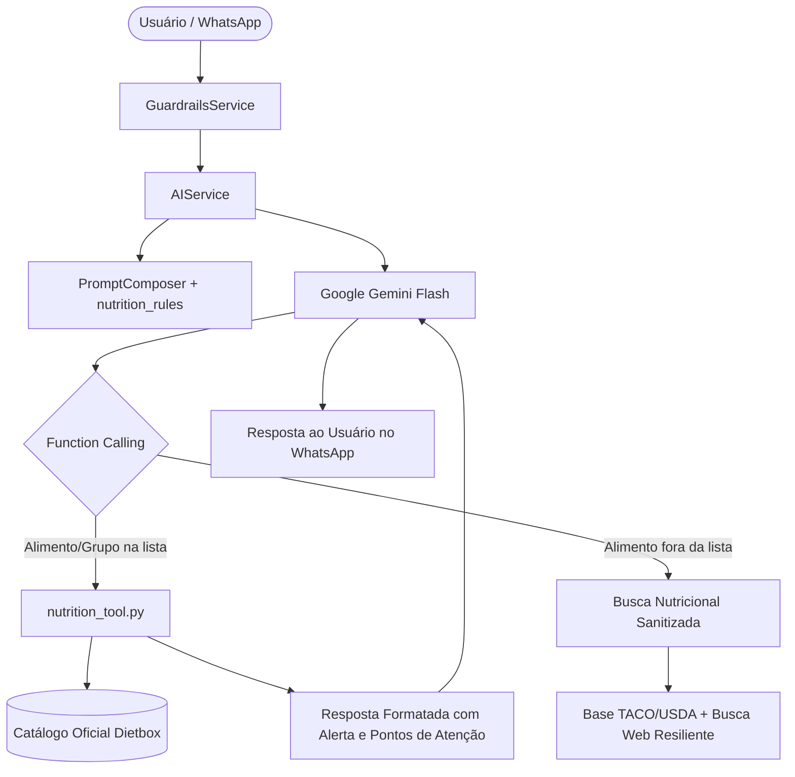

# Arquitetura Técnica: SB-04 Guia Nutricional & Lista de Substituição (Dietbox)

## 1. Visão Geral da Arquitetura
O subsistema de nutrição é integrado ao DAM através do motor de IA Gemini 3.6 Flash, orquestrado pela camada de ferramentas determinísticas (`services/tools/nutrition_tool.py`) e ancorado em uma base imutável da prescrição do paciente (`services/tools/nutrition_dietbox_data.py`).

## 2. Componentes e Responsabilidades

### 2.1 `nutrition_dietbox_data.py`
- Estrutura estática indexada contendo os 132 alimentos prescritos em 05/10/2023.
- Dicionário estruturado por grupos calóricos e mapa de busca rápida por termos normalizados (`normalize_name`), suportando singular/plural e sinônimos.

### 2.2 `nutrition_tool.py`
- Implementa as funções compatíveis com a API de Function Calling do Gemini:
  - `consultar_lista_substituicao(alimento_ou_grupo: str) -> str`: Consulta itens ou grupos inteiros.
  - `avaliar_substituicao_alimento(alimento_desejado: str, alimento_a_substituir: str = "") -> str`: Avalia se o alimento desejado pode substituir um alimento prescrito ou se está fora da lista.
- Mecanismo de Busca Nutricional Segura para itens fora da lista:
  - Sanitização rigorosa do termo de busca (sem injeção de parâmetros, sem caracteres de controle).
  - Consulta nutricional enriquecida contendo calorias, proteínas, carboidratos, gorduras, fibras e sódio.
  - Elaboração dos pontos de atenção clínicos (densidade calórica, índice glicêmico, gorduras saturadas, sódio).

### 2.3 `nutrition_rules.py` & `PromptComposer`
- Prompt de sistema com diretrizes estritas de comportamento para a IA:
  - Obrigação de usar as ferramentas nutricionais sempre que o assunto envolver alimentação, comida, dietbox ou substituições.
  - Nunca inventar porções ou aprovar alimentos fora da lista sem o alerta formal.
