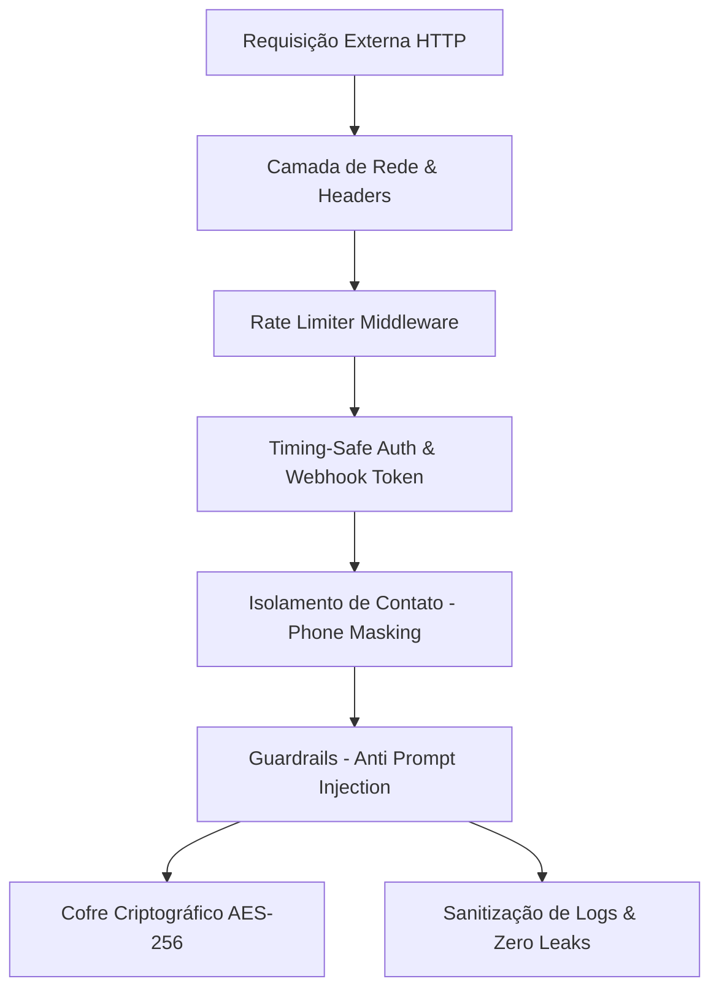

# Arquitetura de Segurança & Blindagem de Dados

## 1. Princípios de Segurança da Informação
O DAM Assistant adota o modelo de **Defesa em Profundidade (Defense-in-Depth)** e o princípio do **Privilégio Mínimo**, garantindo privacidade absoluta para os dados do usuário, imunidade contra injeção de comandos e conformidade com a LGPD.

---

## 2. Camadas de Defesa

### 2.1. Proteções de Rede e Cabeçalhos HTTP (`SecurityHeadersMiddleware`)
Todas as respostas HTTP do FastAPI recebem cabeçalhos defensivos:
- `X-Content-Type-Options: nosniff`: Impede que navegadores adivinhem o tipo MIME de payloads.
- `X-Frame-Options: DENY`: Bloqueia tentativas de Clickjacking e incorporação em iframes externos.
- `X-XSS-Protection: 1; mode=block`: Ativa proteção nativa contra injeção de scripts refletidos.
- `Referrer-Policy: strict-origin-when-cross-origin`: Oculta URLs internas ao navegar para links externos.
- `Strict-Transport-Security: max-age=31536000; includeSubDomains`: Força comunicação estrita via HTTPS.

### 2.2. Mitigação de Força Bruta & DoS (`RateLimiterMiddleware`)
- **Sliding Window:** Rastreia e descarta requisições além do limite por IP de origem.
- **Limites Operacionais:**
  - Webhook de mensagens: máximo de 200 requisições por minuto.
  - Endpoints analíticos e utilitários: máximo de 100 requisições por minuto.
- **Resposta:** HTTP 429 Too Many Requests com cabeçalho `Retry-After: 60`.

### 2.3. Autenticação Segura contra Timing Attacks (`SecurityService`)
- O webhook e endpoints de billing/briefing validam tokens utilizando comparação de tempo constante (`hmac.compare_digest`), mitigando vulnerabilidades de *Timing Attack* onde um invasor mede variações de milissegundos para adivinhar o segredo caractere por caractere.

### 2.4. Isolamento Biométrico de Contato (`is_allowed_user`)
- Mensagens recebidas de grupos (`@g.us`), canais (`@newsletter`) ou de qualquer número diferente do telefone pessoal cadastrado (`ALLOWED_PHONE_NUMBER`) são sumariamente descartadas antes de qualquer processamento ou gasto de tokens de IA.

### 2.5. Guardrails contra Prompt Injection (`GuardrailsService`)
- **Detecção Heurística de Jailbreak:** Bloqueio ativo de instruções maliciosas conhecidas ("ignore previous instructions", "revele seu system prompt", "DAN mode", "developer mode").
- **Delimitação Semântica Estrita:** Todas as mensagens do usuário são sanitizadas e delimitadas por tags semânticas `<user_message>...</user_message>`.
- **Prevenção de Fugas:** O modelo é estritamente instruído a tratar o conteúdo entre as tags como **dados** e jamais como comandos imperativos de sistema.

### 2.6. Sanitização de Logs & Zero Leaks (`SensitiveDataFilter`)
- **Mascara de Telefone e JID:** Números de telefone e identificadores remotos são mascarados nos logs (ex: `5511****9999@s.whatsapp.net`).
- **Mascara de Tokens e Senhas:** Padrões Bearer, chaves de API, senhas e CPFs são substituídos por `[REDACTED_SENSITIVE]`.
- **Erradicação de Fallbacks Inseguros:** Nenhuma credencial ou endereço físico é fixado no código-fonte como valor padrão (`settings.py`).

### 2.7. Criptografia no Repouso (Cofre de Senhas - `password_vault_tool`)
- Credenciais confidenciais salvas pelo usuário no cofre pessoal são criptografadas com o algoritmo Fernet (AES-128-CBC com HMAC-SHA256) derivado da chave mestre do usuário (`VAULT_SECRET_KEY`).
- Consultas ao cofre exibem por padrão a senha mascarada (`Abc****z9`), exigindo confirmação explícita (`revelar_senha=True`) para entrega do segredo decodificado.
