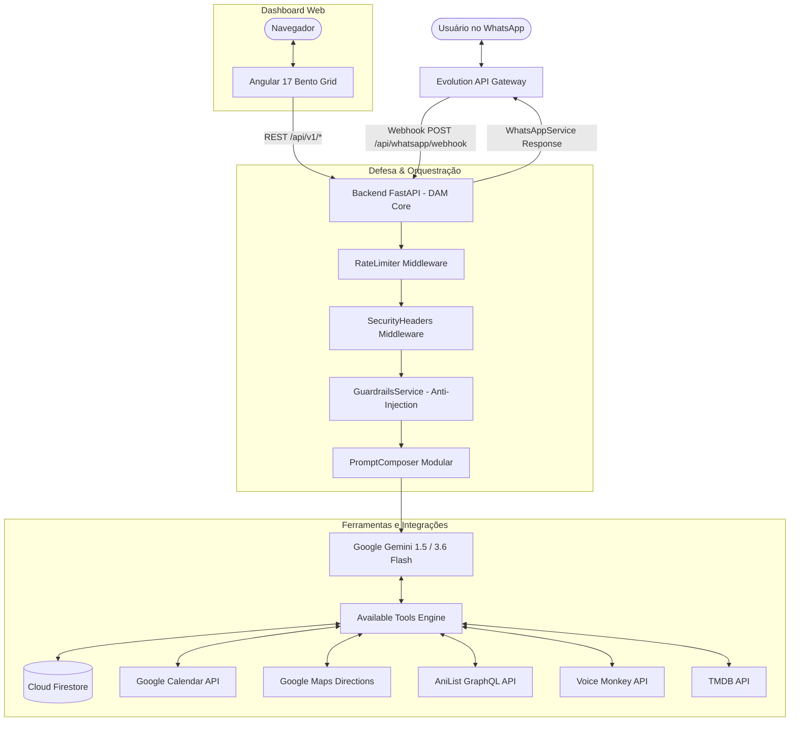

# Arquitetura do Sistema DAM Assistant

## 1. Visão Geral da Arquitetura
O DAM (Digital Autonomous Manager) é um ecossistema de assistência pessoal inteligente multimodal projetado para operar com alta disponibilidade, baixa latência e custo operacional minimizado (FinOps em Google Cloud Platform).

A solução é composta por:
1. **WhatsApp Gateway (Evolution API):** Instância desacoplada de comunicação com o WhatsApp Web, conectada a um banco relacional PostgreSQL para gerenciamento de sessões e instâncias.
2. **Motor de IA & APIs (FastAPI - `backend_ia`):** Aplicação Python assíncrona conteinerizada que executa a orquestração de ferramentas, chamada a LLMs (Google Gemini 1.5/3.6 Flash), processamento multimodal de visão e áudio, guardrails de segurança e agendamentos proativos.
3. **Persistência de Estado (Cloud Firestore):** Banco NoSQL distribuído serverless para histórico de conversas, lançamentos financeiros, saúde, senhas criptografadas, animes e tarefas.
4. **Interface Visual (Angular 17 - `frontend_dashboard`):** Dashboard analítico web moderno (estilo Bento Grid) hospedado no Firebase Hosting para visualização de métricas financeiras, de saúde e agenda.

## 2. Fluxo Assíncrono de Mensagens
Para evitar timeouts do gateway do WhatsApp (Evolution API exige resposta rápida em até 2 segundos):
1. O webhook recebe o evento `messages.upsert`.
2. Valida o token de segurança (`SecurityService.validate_webhook_token`) com proteção contra *timing attacks*.
3. Valida isolamento de número pessoal (`is_allowed_user`).
4. Enfileira o processamento em `BackgroundTasks` do FastAPI (`process_and_reply`).
5. Retorna imediatamente `{"status": "processing"}` com status HTTP 200.
6. A tarefa em segundo plano executa a análise de segurança, invoca o modelo generativo Gemini com chamada de ferramentas automáticas (`enable_automatic_function_calling=True`), salva o histórico de chat no Firestore e envia a resposta ao usuário pelo `WhatsAppService`.

## 3. Padrões de Projeto Adotados
- **Repository Pattern:** Desacoplamento da camada de dados (`ChatRepository`) das rotas HTTP.
- **Modular Prompting:** Separação das instruções mestras por domínios funcionais através do `PromptComposer`.
- **Sliding Window Rate Limiter:** Middleware de mitigação de abusos e ataques DoS.
- **Defense in Depth (Defesa em Profundidade):** Múltiplas camadas de checagem contra prompt injection, sanitização de logs e isolamento de número pessoal.
