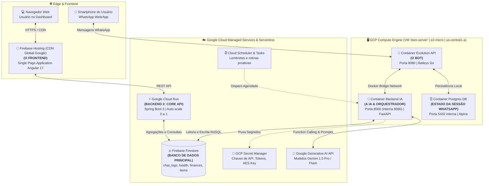
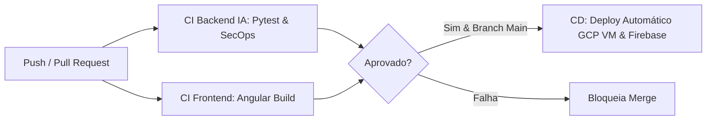

# 🤖 DAM Assistant - Central de Inteligência Pessoal

O **DAM Assistant** é um assistente pessoal inteligente operado diretamente pelo **WhatsApp**, projetado para atuar como um "segundo cérebro" e central de vida automatizada. O sistema combina agentes inteligentes com *Function Calling*, visão computacional, processamento de áudio, integrações de APIs e um dashboard analítico web.

---

## 🛠️ Stack Tecnológica

### 🧠 Backend 1: Motor de IA & Mensageria
* **Linguagem & Framework:** Python 3.12 | FastAPI | Uvicorn
* **Inteligência Artificial:** Google Generative AI SDK (Gemini 1.5 Pro / Flash) com suporte nativo a *Function Calling* e visão multimodal
* **Integração WhatsApp:** Evolution API v2 (Go / Baileys) operando em container
* **Testes & Qualidade:** Pytest (TDD rigoroso, testes de integração e testes ofensivos de segurança SecOps)

### 📊 Backend 2: Core API (Dashboard)
* **Linguagem & Framework:** Java 17+ | Spring Boot 3 (Web, Actuator, Validation)
* **Padrões:** Controller -> Service -> Repository Pattern | DTOs desacoplados
* **Documentação:** OpenAPI / Swagger UI

### 💻 Frontend: Dashboard Web
* **Linguagem & Framework:** TypeScript | Angular 17+ (Standalone Components)
* **Estilização:** SCSS Puro modular (Design System customizado, Bento Grid)
* **Hospedagem:** Firebase Hosting

### ☁️ Banco de Dados & Infraestrutura
* **Banco de Dados:** Firebase Firestore (NoSQL, coleções distribuídas e índices otimizados)
* **Cloud & DevOps:** Google Cloud Platform (Compute Engine VM `e2-micro`, Cloud Run, Cloud Tasks, Secret Manager)
* **Containerização:** Docker e Docker Compose com multi-stage build

---

## 🏗️ Arquitetura da Solução

O ecossistema é baseado em microsserviços desacoplados e orientados a eventos, garantindo que o webhook de mensageria responda em milissegundos enquanto as tarefas pesadas de IA e integrações rodam de forma assíncrona.

```mermaid
graph TD;
    User[Usuário WhatsApp] <--> |Evolution API| Mensageria[FastAPI Motor LLM]
    Mensageria <--> |Function Calling| Tools[Módulos de Integração & Tools]
    Mensageria <--> Firestore[(Firebase Firestore)]
    
    Tools -.-> Health[Health Auto Export Webhook]
    Tools -.-> Veiculo[Uconnect API - Veículo]
    Tools -.-> Esports[HLTV API - CS2]
    Tools -.-> Calendar[Google Calendar API]
    Tools -.-> Alexa[Alexa Webhooks]
    Tools -.-> Maps[Google Maps Directions API]
    Tools -.-> Notes[Anotações & Lembretes]
    Tools -.-> Gifts[Curador de Presentes]
    Tools -.-> Split[Divisor de Contas OCR]
    Tools -.-> Items[Memória Espacial de Objetos]
    Tools -.-> Vault[Cofre de Senhas AES-256]
    Tools -.-> Stream[Guia de Streaming TMDB]
    Tools -.-> BBQ[Calculadora de Churrasco]
    Tools -.-> MenuTrans[Tradutor de Cardápios Vision]
    Tools -.-> Converter[Conversor Universal]
    Tools -.-> TripSplit[Splitwise de Bolso]
    Tools -.-> WorkHours[Calculadora de Banco de Horas]
    
    GCPBilling[GCP Pub/Sub] --> Mensageria
    
    Front[Dashboard Angular] <--> |REST API| CoreAPI[Spring Boot Core]
    CoreAPI <--> Firestore
```



---

## 🗺️ Topologia de Infraestrutura & Onde Roda Cada Coisa

Esta seção detalha exatamente a divisão física e lógica de todos os componentes da arquitetura, respondendo onde cada peça da solução está hospedada e como elas se comunicam.



---

### 📌 Resumo Direto de Infraestrutura: O Que Fica Onde?

#### 1. 🖥️ O que está na Máquina Virtual (`dam-server` no GCP Compute Engine)?
A VM é uma instância **Debian 12** do tipo `e2-micro` (1 vCPU, 1 GB de RAM, elegível ao *Free Tier* permanente do GCP), localizada na zona `us-central1-a` sob o IP externo `35.254.233.21`. Dentro dela roda o **Docker Compose** orquestrando 3 containers fundamentais:
* **Container `backend_ia`:** O motor de inteligência artificial em Python 3.12 / FastAPI (escuta na porta `8000`).
* **Container `evolution_api`:** O gateway de conexão ao WhatsApp baseado em Baileys v2 (escuta na porta `8080`).
* **Container `postgres_db`:** Banco de dados PostgreSQL 15 Alpine exclusivo da Evolution API para armazenar tokens de sessão e chaves de criptografia do WhatsApp (porta interna `5432`).

#### 2. 🤖 Onde está o "Bot"?
O **Bot do WhatsApp** é a junção simbiótica de dois containers dentro da VM:
* A **Evolution API** cuida da camada de rede do WhatsApp: mantém o WebSocket conectado com os servidores da Meta, gera o QR Code e recebe as mensagens brutas.
* O **Backend IA** recebe os webhooks locais instantaneamente da Evolution API via Docker bridge, interpreta a intenção do usuário, decide se executa ferramentas e devolve a resposta no chat.
* Ambos rodam na mesma VM para que a comunicação entre o WhatsApp e a IA ocorra em **menos de 10 milissegundos**, sem overhead de rede pública.

#### 3. 🧠 Onde está a Inteligência Artificial (AI)?
* O **código do orquestrador de IA** roda no container `backend_ia` na VM Compute Engine (`services/ai_service.py` e `services/tools/`).
* O **modelo de linguagem (LLM)** em si é processado na infraestrutura de supercomputação do Google via **Google Generative AI SDK**, consumindo os modelos **Gemini 1.5 Pro** (para raciocínio complexo, multirrodadas e visão) e **Gemini 1.5 Flash** (para respostas rápidas e OCR de notas fiscais).

#### 4. 💻 Onde está hospedado o Frontend?
* O **Dashboard Web** está hospedado no **Firebase Hosting** (serviço de CDN global e Edge da Google).
* **Tecnologia:** Single Page Application (SPA) compilada em **Angular 17+** com Standalone Components e SCSS modular.
* **Vantagens:** Distribuição global em milissegundos via Anycast IP, certificado SSL TLS 1.3 automático e gratuito, e custo zero de computação (não necessita de servidor web ligado 24/7).

#### 5. ⚙️ Onde está o Backend? (Arquitetura Dual-Backend)
O projeto utiliza propositalmente dois backends especializados por domínio:
* **Backend 1 (Motor de IA & Mensageria):** Está na **VM Compute Engine** rodando em **FastAPI (Python 3.12)**. Especializado em eventos assíncronos de chat, chamadas dinâmicas ao Gemini e processamento rápido de webhooks.
* **Backend 2 (Core API de Negócio & Dashboard):** Está no **Google Cloud Run** rodando em **Spring Boot 3 (Java 17)**. Especializado em regras de negócio empresariais, relatórios consolidados e fornecimento de endpoints REST para a interface Angular.

#### 6. ⚡ O que está no Google Cloud Run?
* A **Core API** em **Spring Boot 3**.
* O Cloud Run é uma plataforma *Serverless* de containers gerenciados:
  * Se ninguém estiver acessando o Dashboard Web, ele **escala para 0 instâncias**, não consumindo CPU nem gerando custos (princípio fundamental de FinOps).
  * Quando o usuário abre o dashboard no navegador, o Cloud Run sobe um container instantaneamente para responder às requisições do Angular e depois hiberna.

#### 7. 🗄️ Onde está o Banco de Dados?
Existem dois bancos com funções distintas:
* **Banco de Dados Principal da Solução (DAM):** **Google Cloud Firestore** (modo Nativo NoSQL). É um banco totalmente gerenciado pela Google, multi-regional, com alta disponibilidade e replicação automática. Armazena:
  * `chat_logs` (histórico de mensagens e memória do bot)
  * `health_metrics` (métricas de sono, passos, calorias do Health Auto Export)
  * `finances` (receitas e despesas categorizadas)
  * `item_locations` (memória espacial de objetos guardados)
  * `vault_credentials` (credenciais criptografadas)
* **Banco Local da Evolution API:** **PostgreSQL 15 Alpine**, isolado dentro da VM Compute Engine, utilizado única e exclusivamente pelo motor Baileys da Evolution API para manter a autenticação da sessão do WhatsApp persistida em disco (`volume: evolution_instances`).

#### 8. 🔐 Onde ficam as senhas e chaves de API (Segurança)?
* **GCP Secret Manager:** As credenciais críticas (`GEMINI_API_KEY`, `EVOLUTION_API_KEY`, chave mestre AES-256 do cofre) ficam encriptadas no Secret Manager e são injetadas nas instâncias em tempo de execução via variáveis de ambiente com permissão IAM mínima.
* **Criptografia em Repouso:** Dados do Firestore são criptografados nativamente pelo Google com AES-256, e o cofre de senhas (Fase 13) possui uma camada adicional de criptografia de aplicação cliente (Zero-Knowledge).

---

### 📋 Mapeamento Completo de Componentes vs Infraestrutura

A tabela abaixo sumariza com precisão **onde cada funcionalidade está hospedada**, seu runtime e portas:

| Funcionalidade / Domínio | Componente de Deploy | Infraestrutura / Provedor | Especificações & Recursos | Portas & Rede |
| :--- | :--- | :--- | :--- | :--- |
| **Motor de IA & Agentes** (Chat, Gemini, Function Calling, Histórico) | Container `dam_backend_ia` | GCP Compute Engine (VM `dam-server`) | `e2-micro` (1 vCPU, 1 GB RAM, Linux Debian) | Porta `8000` (FastAPI / Uvicorn) |
| **Webhook WhatsApp & Preservação Notificações** (US-3.5) | Container `dam_backend_ia` | GCP Compute Engine (VM `dam-server`) | Python 3.12, thread pool assíncrono | Interna via Docker Network bridge |
| **Gateway WhatsApp & Baileys** (Sessão QR Code) | Container `evolution_api` | GCP Compute Engine (VM `dam-server`) | Go / Node Runtime Baileys v2 | Porta `8080` pública (Firewall GCP `allow-dam-ports`) |
| **Banco da Sessão WhatsApp** | Container `postgres_db` | GCP Compute Engine (VM `dam-server`) | PostgreSQL 15 Alpine (volume `evolution_instances`) | Porta `5432` (isolada, sem exposição externa) |
| **Pilar 1: Ingestão de Saúde** (`/api/health-webhook`) | Container `dam_backend_ia` | GCP Compute Engine (VM `dam-server`) | Endpoint REST HTTPS via Cloudflare/Nginx | Porta `8000` |
| **Pilar 2: Gestão Financeira** (`finance_tool`) | Container `dam_backend_ia` | GCP Compute Engine (VM `dam-server`) | Executado inline no Motor Gemini | Gravação direta no Firestore |
| **Pilar 3: Google Calendar** (`calendar_tool`) | Container `dam_backend_ia` | GCP Compute Engine (VM `dam-server`) | Autenticação Service Account OAuth2 GCP | Saída HTTPS para `googleapis.com` |
| **Pilar 4: Veículo Fiat Fastback** (Fase 4) | Cloud Run Job / Worker | GCP Cloud Run (Serverless) | Python 3.12, 512 MB RAM, invocação periódica | Tráfego seguro via HTTPS |
| **Pilar 5: Esports CS2** (Fase 4) | Container `dam_backend_ia` | GCP Compute Engine (VM `dam-server`) | Scraper assíncrono BeautifulSoup / HLTV | Saída HTTPS |
| **Pilar 6: FinOps GCP & Alexa** (Fase 5) | GCP Pub/Sub + Cloud Function | GCP Serverless Eventarc | Trigger automático em threshold de billing | Push HTTP para Webhook DAM |
| **Pilar 7: Mobilidade Google Maps** (Fase 8) | Container `dam_backend_ia` | GCP Compute Engine (VM `dam-server`) | GCP Directions API Client | Saída HTTPS para `maps.googleapis.com` |
| **Pilar 8: Lembretes & Anotações** (Fase 9) | GCP Cloud Tasks + Backend IA | GCP Cloud Tasks | Fila de agendamento com retry e jitter | Webhook reverso no WhatsApp |
| **Pilar 9: Curador de Presentes** (Fase 10) | Cloud Scheduler + Backend IA | GCP Cloud Scheduler (Cron diário) | Consulta por proximidade de data ($T - 21$ dias) | Push de notificação WhatsApp |
| **Pilar 10: Divisor de Contas OCR** (Fase 11) | Container `dam_backend_ia` | GCP Compute Engine (VM `dam-server`) | Gemini 1.5 Flash Vision (Multimodal OCR) | Processamento de imagem em memória |
| **Pilar 11: Memória Espacial** (Fase 12) | Container `dam_backend_ia` | GCP Compute Engine (VM `dam-server`) | Vetorização semântica (Text Embeddings) | Firestore Vector Search |
| **Pilar 12: Cofre de Senhas** (Fase 13) | Container `dam_backend_ia` | GCP Compute Engine (VM `dam-server`) | Criptografia simétrica AES-256-GCM | Chave mestra no GCP Secret Manager |
| **Pilar 13: Streaming Direto** (Fase 14) | Container `dam_backend_ia` | GCP Compute Engine (VM `dam-server`) | TMDB API / JustWatch Provider | Chamadas REST com cache Redis |
| **Pilar 14: Calculadora de Churrasco** (Fase 15) | Container `dam_backend_ia` | GCP Compute Engine (VM `dam-server`) | Motor algorítmico determinístico | Execução local CPU < 5ms |
| **Pilar 15: Tradutor de Cardápios** (Fase 16) | Container `dam_backend_ia` | GCP Compute Engine (VM `dam-server`) | Gemini 1.5 Pro Vision + Prompt Gastronômico | Multimodalidade em tempo real |
| **Pilar 16: Conversor Universal** (Fase 17) | Container `dam_backend_ia` | GCP Compute Engine (VM `dam-server`) | Funções matemáticas puras em Python | Execução instantânea sem LLM |
| **Pilar 17: Splitwise de Bolso** (Fase 18) | Container `dam_backend_ia` | GCP Compute Engine (VM `dam-server`) | Algoritmo de Minimização de Balanço de Dívidas | Persistência em subcoleções Firestore |
| **Pilar 18: Banco de Horas** (Fase 19) | Container `dam_backend_ia` | GCP Compute Engine (VM `dam-server`) | Motor determinístico de cálculo de horas e balanço | Gravação opcional no Firestore |
| **Core API de Negócio** (Dashboard) | Container Spring Boot | GCP Cloud Run (Serverless) | Java 17, 1-2 instâncias automáticas | Porta `8080` (HTTPS gerenciado) |
| **Dashboard Web UI** | Single Page Application (SPA) | Firebase Hosting (CDN Global Google) | Angular 17 compilado (HTML/JS/SCSS) | Porta `443` HTTPS (Certificado SSL auto) |
| **Banco de Dados Central** | Google Cloud Firestore | Google Cloud (Nativo NoSQL) | Escalonamento automático multi-regional | Conexão criptografada gRPC / SDK |
| **Gestão de Segredos** | GCP Secret Manager | Google Cloud Security | Armazenamento de chaves de API e tokens | IAM Least Privilege (Service Account) |

---

## 🔄 Pipeline de CI/CD (GitHub Actions)

O projeto conta com uma esteira de entrega contínua automatizada definida em [`.github/workflows/ci-cd.yml`](file:///c:/Users/PC/Documents/GitHub/DAM/.github/workflows/ci-cd.yml):



1. **Job `backend-ia-ci`:**
   * Executa em ambiente Python 3.12 limpo (`ubuntu-latest`).
   * Roda todos os testes unitários de isolamento de webhook e regras de negócio.
   * Executa a suíte de testes de penetração e segurança ofensiva (SecOps) contra injeções SQL, spoofing de JID e payloads maliciosos.
2. **Job `frontend-dashboard-ci`:**
   * Executa no Node.js 20 (`ubuntu-latest`).
   * Executa `npm ci` e valida a compilação do bundle de produção do Angular 17.
3. **Job `deploy-production`:**
   * Disparado exclusivamente em merges/pushes na branch `main`.
   * Autentica no Google Cloud via chave de Service Account configurada nos Secrets do GitHub (`GCP_SA_KEY`).
   * Empacota o código limpo (ignorando ambientes virtuais e caches) e sincroniza com a VM `dam-server`.
   * Executa o `docker compose up -d --build` remotamente e atualiza o Firebase Hosting.

## 🚀 Features Implementadas

### 📱 Mensageria & Motor de IA
* **Webhook de Alta Performance:** Endpoint assíncrono `/api/whatsapp/webhook` no FastAPI com tempo de resposta imediato (HTTP 200) e execução em background.
* **Isolamento Estrito & Preservação de Notificações (US-3.5):**
  * O assistente responde **exclusivamente na conversa com o próprio usuário** (validação estrita de número com tolerância ao 9º dígito brasileiro).
  * Mensagens de grupos (`@g.us`) e canais são sumariamente descartadas.
  * *Fail-safe* ativo: se o número autorizado não estiver configurado, nenhuma mensagem é processada.
  * Desativação de recibos de leitura automática (`readMessages=false`, `readStatus=false`) na Evolution API, garantindo que as **notificações do celular do usuário nunca sejam suprimidas**.
* **Anti-Looping:** Filtragem com caractere invisível (`\u200b`) impedindo que o bot responda às suas próprias mensagens.
* **Segurança de Webhook:** Autenticação obrigatória via `apikey` / `Authorization Bearer Token` com proteção contra injeções.

### 🩺 Pilar 1: Saúde & Métricas Corporais
* **Ingestão de Dados de Saúde:** Endpoint `/api/health-webhook` para receber métricas enviadas pelo app iOS *Health Auto Export* (passos, queima calórica, batimentos cardíacos, sono).
* **Tool LLM de Saúde:** O usuário pode consultar seus dados corporais e tendências de saúde diretamente pelo chat em linguagem natural (*"Quantos passos dei hoje?"*, *"Qual foi minha média de batimentos essa semana?"*).

### 💰 Pilar 2: Gestão Financeira
* **Tool de Lançamentos Financeiros:** Registro inteligente de despesas e receitas por texto (*"Gastei R$ 45 no almoço"*), com categorização e persistência no Firestore (`finances`).

### 📅 Pilar 3: Google Calendar
* **Agendamento Inteligente:** Criação de compromissos no Google Calendar via Service Account GCP a partir de comandos informais (*"Marque dentista amanhã às 14h"*).

### 🖥️ Dashboard Web (Fundação)
* Estrutura da Core API em **Spring Boot 3** e interface moderna em **Angular 17** com Standalone Components para visualização consolidada de métricas.

---

## 🗺️ Features Planejadas (Roadmap)

### 🎧 Fase 3 (Complementos em Andamento)
* **Mensagens Multimodais (US-3.6):** Recepção de áudios (transcrição via Gemini) e fotos de comprovantes no WhatsApp.
* **Google Calendar Enriquecido (US-3.7):** Suporte nativo a descrição detalhada e localização física no agendamento.
* **Integração Real do Dashboard (US-3.8):** Leitura direta dos dados vivos do Firestore nos componentes gráficos do Angular.

### 🚗 Fase 4: Integrações Externas Avançadas
* **Veículo (Fiat Fastback):** Monitoramento de combustível/autonomia, status das portas e acionamento de travas via Uconnect API.
* **Esports (Counter-Strike 2):** Placares em tempo real e calendário de jogos via HLTV.

### 🏠 Fase 5: Automação Residencial & FinOps
* **Alertas de Custos GCP:** Alertas proativos no WhatsApp sobre orçamento da nuvem via Pub/Sub Push.
* **Alexa Smart Home:** Acionamento de rotinas residenciais por requisições HTTP.

### 🗺️ Fase 8: Mobilidade Urbana & Trânsito (Google Maps)
* **Directions API em Tempo Real:** Consulta de rotas mais rápidas, distância e tempo estimado com trânsito atual (*"Como está o trânsito até o aeroporto?"*).
* **Alerta de Saída:** Cruzamento automático do trânsito com eventos da agenda para avisar o horário ideal de sair de casa.

### 🧠 Fase 9: Segundo Cérebro (Anotações e Lembretes)
* **Anotações Estruturadas:** Registro e busca semântica de ideias, notas e informações do dia a dia.
* **Lembretes Ativos no WhatsApp:** Notificação proativa enviada no chat no dia e horário estipulados.

### 🎁 Fase 10: Curador de Presentes & Datas Especiais
* **Memória Afetiva:** Captura de comentários casuais ao longo do ano (*"Minha namorada comentou que gostou de um perfume da loja X"*).
* **Alerta Proativo Antecipado:** Notificação no WhatsApp de 2 a 4 semanas antes de aniversários ou datas comemorativas resgatando a anotação exata feita no passado.

### 🧾 Fase 11: Divisor de Contas de Restaurante (Instantâneo)
* **OCR de Comandas:** Foto da conta da mesa lida via Gemini Vision.
* **Rateio em Linguagem Natural:** Interpretação de quem consumiu o quê, cálculo proporcional dos 10% do garçom e envio do valor individual com chave Pix pronta para pagamento.

### 📦 Fase 12: Memória Espacial ("Onde Guardei Isso?")
* **Localizador de Objetos:** Mensagens rápidas (*"Guardei o passaporte na gaveta de cima do armário"* ou *"A chave reserva está na caixa preta"*).
* **Busca Semântica:** Recuperação imediata ao perguntar *"Onde está meu passaporte?"* ou *"Cadê a chave do carro?"*.

### 🔐 Fase 13: Cofre Seguro de Senhas (Zero-Knowledge)
* **Criptografia AES-256-GCM:** Armazenamento autenticado de credenciais com chave mestra protegida no GCP Secret Manager.
* **Sanitização de Logs:** Mascaramento obrigatório impedindo vazamento de senhas em logs ou console.
* **Gerador de Senhas Fortes:** Criação de senhas de alta entropia sob demanda.

### 🎬 Fase 14: Guia de Streaming Direto ("Onde Assistir?")
* **Catálogo Unificado (TMDB / JustWatch):** Resposta imediata indicando em qual plataforma (Netflix, Max, Prime Video, Disney+, etc.) qualquer filme ou série está disponível no Brasil.

### 🥩 Fase 15: Calculadora Inteligente de Churrasco e Eventos
* **Planejador Volumétrico:** Cálculo exato per capita de carnes (por tipo), carvão, fardos de cerveja, refrigerante e gelo a partir da descrição do evento (*"Churrasco para 12 adultos e 4 crianças das 14h às 20h"*).

### 🌍 Fase 16: Tradutor Gastronômico de Cardápios ao Vivo
* **Guia de Viagem (Vision):** Foto do cardápio em qualquer idioma estrangeiro com tradução e explicação gastronômica detalhada de ingredientes, preparo e alérgenos.

### ⚖️ Fase 17: Conversor Universal Instantâneo
* **Motor Determinístico:** Conversões exatas sem alucinações (Milhas $\leftrightarrow$ KM, Pés $\leftrightarrow$ CM, Fahrenheit $\leftrightarrow$ Celsius, Libras $\leftrightarrow$ KG).

### 🏖️ Fase 18: "Splitwise" de Bolso para Viagens
* **Ledger Contínuo de Despesas:** Registro incremental de gastos durante viagens em grupo com amigos.
* **Minimização de Dívidas:** Algoritmo de fechamento que liquida todas as pendências com o menor número possível de transferências Pix.

### ⏱️ Fase 19: Calculadora Inteligente de Banco de Horas Semanal
* **Parser de Horários em Linguagem Natural:** Interpretação flexível de horários quebrados informados em texto livre ou áudio (*"Segunda fiz 9h, Terça 7h30, Quarta 10h"*).
* **Motor Determinístico de Balanço:** Cálculo matemático exato em minutos contra a meta de jornada (padrão 8h/dia ou 40h/semana), eliminando risco de alucinações aritméticas da LLM.
* **Diagnóstico de Saldo:** Resposta clara no WhatsApp informando total trabalhado, meta esperada e se o usuário está com horas a receber (crédito) ou devendo horas a compensar.
* **Modo Instantâneo e Registro Opcional:** Permite tanto o cálculo rápido "on-the-fly" quanto o registro contínuo ao longo da semana no Firestore.

---

## ⚙️ Como Executar Localmente

### Pré-requisitos
* Python 3.12+
* Docker & Docker Compose
* Conta no Firebase com projeto ativo e credenciais baixadas

### Passo a Passo

1. **Clone o repositório:**
   ```bash
   git clone https://github.com/D4NL18/DAM.git
   cd DAM
   ```

2. **Configuração de Variáveis de Ambiente:**
   Copie o arquivo de exemplo e preencha as chaves:
   ```bash
   cp backend_ia/.env.example backend_ia/.env
   ```
   * Adicione a chave do Gemini (`GEMINI_API_KEY`).
   * Adicione seu telefone pessoal (`ALLOWED_PHONE_NUMBER=5511999999999`).
   * Coloque o arquivo `firebase-adminsdk.json` dentro de `backend_ia/`.

3. **Subir com Docker Compose:**
   ```bash
   docker-compose up -d --build
   ```

4. **Conectar o WhatsApp:**
   Execute o script auxiliar para gerar o QR Code de autenticação no navegador:
   ```bash
   python conectar_whatsapp.py
   ```

5. **Executar a Suíte de Testes:**
   ```bash
   cd backend_ia
   pytest -v tests
   ```
